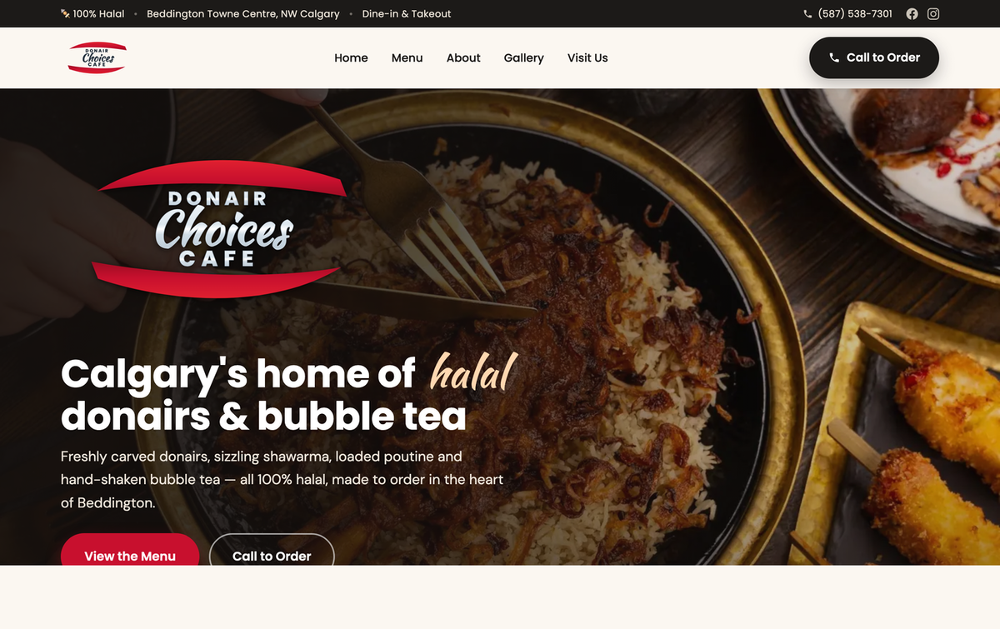
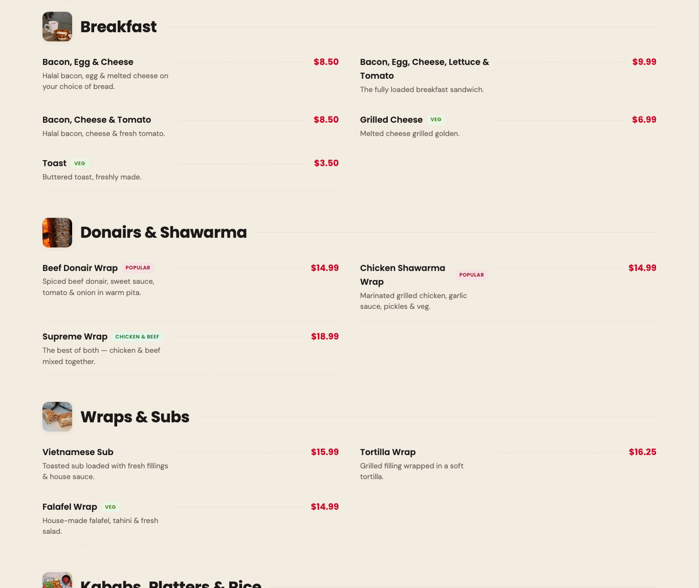
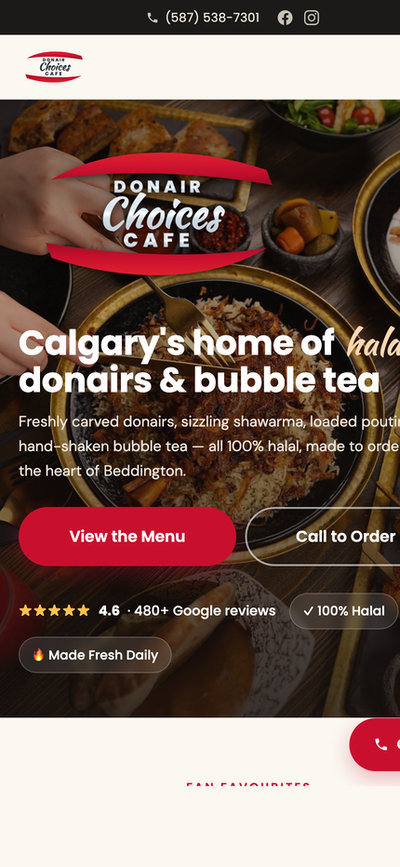

<div align="center">

# 🥙 Donair Choices Cafe — Website

**Elegant, fast, mobile-first website for a halal donair & shawarma cafe in NW Calgary.**

[](https://donairchoicescafe.ca)
&nbsp;
[](https://blacklayers.ca)

🔗 **Live:** https://donairchoicescafe.ca



</div>

---

## ✨ Overview

A complete brand + web build for **Donair Choices Cafe** (Beddington Towne Centre, Calgary) —
from a hand-recreated logo to a polished, SEO-ready site deployed on a custom domain with HTTPS.

- 🎨 **Logo recreated from scratch** as a scalable SVG (red lens swooshes + chrome wordmark)
- 📋 **Full menu** with real items & prices, filterable by category
- ⚡ **Fast & lightweight** — plain HTML/CSS/JS, no framework, optimized WebP images
- 📱 **Mobile-first** — full-screen mobile menu, fluid layouts, tap-friendly
- 🔎 **SEO & local search** — meta tags, Open Graph, `Restaurant` structured data, sitemap
- 🔒 **Live on a custom domain** with automatic HTTPS

## 📸 Screenshots

| Menu (desktop) | Mobile |
|:---:|:---:|
|  |  |

## 🧱 Tech Stack

| Layer | Tech |
|-------|------|
| Frontend | Semantic **HTML5**, modern **CSS** (grid/flex, custom properties), vanilla **JavaScript** |
| Type & icons | Google Fonts (Poppins · DM Sans · Kaushan Script), inline SVG brand icons |
| Logo & brand | Hand-authored **SVG** (favicon, social card, light/dark variants) |
| Media | Optimized **WebP** imagery, lazy-loading |
| SEO | Open Graph, Twitter cards, JSON-LD `Restaurant` schema, `sitemap.xml`, `robots.txt` |
| Hosting | **GitHub Pages** + custom domain (Namecheap DNS) + auto HTTPS |
| Backend (scaffold) | Node.js + **MongoDB** driver (pooled) — ready for future dynamic features |

## 📂 Project Structure

```
donairchoicescafe/
├─ index.html            # single-page site (all sections)
├─ css/styles.css        # design system + components
├─ js/main.js            # menu filter, mobile nav, gallery lightbox
├─ assets/
│  ├─ logo/              # SVG logo, favicon, social card, app icons
│  └─ images/            # optimized food & gallery photos (WebP)
├─ backend/              # MongoDB connection scaffold (future features)
├─ docs/                 # deployment & domain setup guides + screenshots
├─ CNAME                 # custom domain binding
└─ sitemap.xml · robots.txt · site.webmanifest
```

## 🚀 Run locally

No build step — just open it:
```bash
git clone https://github.com/nextgenhafeez/donairchoicescafe.git
cd donairchoicescafe
open index.html          # or: python3 -m http.server 8000
```

## 🌐 Deploy & update

Hosted on **GitHub Pages**. Any push to `main` redeploys in ~1 minute.
```bash
git add -A && git commit -m "update" && git push
```
Full details: [`docs/DEPLOYMENT.md`](docs/DEPLOYMENT.md) · Domain/DNS: [`docs/DOMAIN-SETUP.md`](docs/DOMAIN-SETUP.md)

## 🗺️ Roadmap

- [x] Brand + logo, full responsive site, SEO
- [x] Live deployment on custom domain + HTTPS
- [x] Real menu, phone, hours, address
- [ ] Real photography of the restaurant
- [ ] Backend-powered **dynamic menu** (edit prices without code)
- [ ] Online ordering + payments

## 📍 The Business

**Donair Choices Cafe** · 100% Halal · Unit 307, 8120 Beddington Blvd NW, Calgary, AB
📞 (587) 538-7301 · ⭐ 4.6 (480+ Google reviews)

---

<div align="center">

Designed & built by **[Black Layers Studio](https://blacklayers.ca)** — *we ship apps that last.*

</div>
